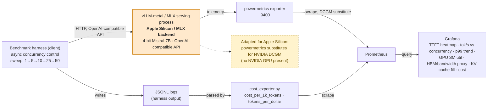

# LLM Upskill via GPT — Week 1–4 Task 1

This project follows the hands-on, first-principles, employer-demonstration
approach defined in [LEARNING_AND_PORTFOLIO_STANDARD.md](LEARNING_AND_PORTFOLIO_STANDARD.md).

See [PHASE1_LOG.md](PHASE1_LOG.md) for a full technical narrative of
debugging decisions, root-cause investigations, and verification
methodology across this project.

## Goal

Deploy vLLM locally and serve a 7B/8B instruction model through its
OpenAI-compatible HTTP API.

Selected model for this M4 Mac mini with 16 GB unified memory:

```text
mlx-community/Mistral-7B-Instruct-v0.3-4bit
```

This is a 4-bit build of Mistral-7B-Instruct. It is validated by the
vLLM-Metal project on this exact M4 Mac mini/16 GB hardware profile and does
not require accepting Meta's Llama license.

## Architecture



The orange box is deliberate: this is not a standard NVIDIA/CUDA vLLM
deployment. Two of the six Grafana panels (GPU SM utilization, HBM
bandwidth) normally come from NVIDIA's DCGM exporter, which doesn't exist
on Apple Silicon — `observability/powermetrics_exporter.py` substitutes a
real `powermetrics`-based signal instead, with the substitution stated
explicitly (see `PHASE1_LOG.md`'s Task 6 entry for how the HBM-bandwidth
panel gap was handled specifically).

### Live dashboard


## Current-machine preflight

This repository is on an Apple-silicon Mac. Plain `pip install vllm` is the
standard Linux/NVIDIA installation, but PyPI does not provide the required
macOS Metal build. The equivalent supported local installation uses the
official prebuilt vLLM core and vLLM-Metal wheels in `.venv-metal`.

```bash
source .venv-metal/bin/activate
vllm --version
```

The model is quantized because an FP16 7B checkpoint would consume almost all
16 GB of unified memory before allocating the KV cache.

Installed versions:

```text
vllm 0.26.0+cpu
vllm-metal 0.3.0.dev20260730125022
Python 3.12.12
```

### Native dependency compatibility note

The working environment pins `apache-tvm-ffi==0.1.12`. Version 0.1.13 caused
the required `xgrammar` extension to crash at import in
`TVMFFIEnvRegisterCAPI` on this machine. Recreate the tested environment with:

```bash
uv venv --python /opt/homebrew/bin/python3.12 --seed .venv-metal
uv pip install --python .venv-metal/bin/python -r requirements-metal.txt
```

Verify the native dependency and CLI:

```bash
.venv-metal/bin/python -c 'import xgrammar; print("xgrammar import OK")'
.venv-metal/bin/vllm --version
```

## Run locally

Start the Metal-accelerated OpenAI-compatible server:

```bash
./scripts/serve.sh
```

In another terminal, verify health and inference:

```bash
./scripts/test-api.sh
```

The expected API base URL is `http://localhost:8000/v1`. Stop the server with
`Ctrl+C`.

Verified locally on macOS 26.6:

- Metal/MLX GPU model loading
- Native paged-attention kernels
- `GET /v1/models`
- `POST /v1/chat/completions`

## What to observe

While the server starts, note model-weight loading, GPU-memory allocation, and
KV-cache sizing in the logs. Then compare the first request's latency with a
second identical request. The second request avoids startup and model-loading
costs.

Useful experiments:

```bash
# Shorter context reduces KV-cache demand.
MAX_MODEL_LEN=2048 ./scripts/serve.sh

# Change the local API key.
VLLM_API_KEY=my-local-key ./scripts/serve.sh
```

## Standard Linux/NVIDIA variant

On a Linux host with an NVIDIA GPU, the task's original install command is:

```bash
python3 -m venv .venv
source .venv/bin/activate
pip install vllm
MODEL=mistralai/Mistral-7B-Instruct-v0.3 \
  VLLM_BIN=.venv/bin/vllm \
  ./scripts/serve.sh
```

## Known issues filed upstream

While building this, two real bugs were identified, root-caused, and reported upstream rather than just worked around silently:

- **[apache/tvm-ffi#697](https://github.com/apache/tvm-ffi/issues/697)** — segfault in `TVMFFIEnvRegisterCAPI` on macOS arm64 with `apache-tvm-ffi==0.1.13`; resolved by pinning `0.1.12` (see the compatibility note above). Cross-posted to **[mlc-ai/xgrammar#799](https://github.com/mlc-ai/xgrammar/issues/799)**, since `xgrammar` is the dependency most people will actually hit this crash through.
- **[vllm-project/vllm-metal#274](https://github.com/vllm-project/vllm-metal/issues/274)** — investigated a Metal OOM crash class on this hardware; found the specific mechanism already covered in more depth by **[vllm-project/vllm-metal#398](https://github.com/vllm-project/vllm-metal/issues/398)** (`metal_limit` reported by Metal is meaningfully less than total system RAM), which was closed via a merged fix. Independently reproduced the same `metal_limit`-vs-total-RAM arithmetic on this machine — see the `--gpu-memory-utilization` breakdown in Phase 1 notes.
